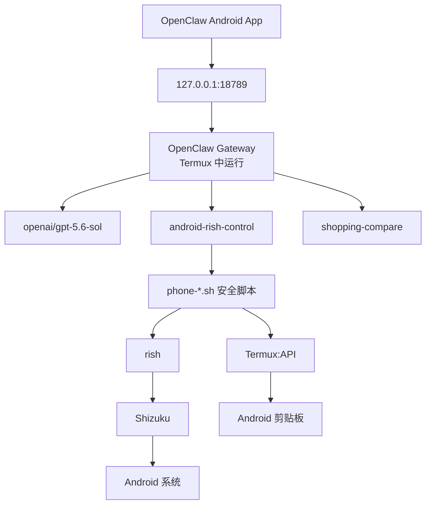

# OpenClaw Android 本地自动化环境搭建与日常使用手册

> **最终整理版**  
> 适用设备：小米 / HyperOS Android 手机  
> 当前方案：**Termux + Shizuku + rish + OpenClaw Gateway + OpenClaw Android App + 自定义 Skill / 手机控制脚本**  
> 更新时间：2026-08-17

---

## 0. 文档目的

本手册只解决两件事：

1. **从零理解并恢复当前 OpenClaw Android 自动化环境**
2. **手机重新开机后，知道最少要做哪些操作才能正常使用**

当前系统已经可以实现：

```text
自然语言指令
    ↓
OpenClaw / GPT
    ↓
android-rish-control Skill
    ↓
安全白名单脚本
    ↓
rish
    ↓
Shizuku
    ↓
Android
    ↓
打开 App / 点击 / 滑动 / 截图 / UI 读取 / 中文输入
```

并已扩展购物场景：

```text
淘宝 / 京东 / 拼多多 / 闲鱼
    ↓
搜索商品
    ↓
读取页面
    ↓
比较价格、规格、店铺和优惠
    ↓
给出性价比分析
```

> **安全边界：** 自动化用于浏览、搜索、读取和比较；下单、支付、账户安全设置、删除数据、发送消息等高影响操作应保留人工确认。

---

# 第一部分：环境搭建与自动化配置

## 1. 当前架构



### 当前关键组件

| 组件 | 当前状态 | 用途 |
|---|---:|---|
| Termux | ✅ GitHub 版 | OpenClaw、脚本、CLI 运行环境 |
| Shizuku | ✅ | 为 rish 提供 Android shell 权限 |
| rish | ✅ | Termux 调用 Shizuku shell |
| OpenClaw CLI | ✅ 2026.7.1-2 | Gateway、Agent、Skill |
| GPT 模型 | ✅ `openai/gpt-5.6-sol` | Agent 推理 |
| OpenClaw Runtime | ✅ | 避开当前 Codex app-server 不稳定链路 |
| Gateway | ✅ `127.0.0.1:18789` | Android App 与 Agent 的本地入口 |
| OpenClaw Android App | ✅ 已配对 | 原生客户端 |
| Termux:API | ✅ | 中文剪贴板输入 |
| `android-rish-control` | ✅ | 手机控制 Skill |
| `shopping-compare` | ✅ | 购物搜索与比较 Skill |
| Gateway 开机自动启动 | ⏳ 建议配置 | 减少重启后的手动操作 |

---

## 2. Termux 基础环境

当前 Termux 来源：

```bash
echo $TERMUX_APK_RELEASE
```

当前应输出：

```text
GITHUB
```

### 重要规则：插件必须与 Termux 同签名来源

当前使用 GitHub 版 Termux，因此：

```text
Termux:API → 使用 GitHub 签名版本
Termux:Boot → 也必须使用与当前 Termux 兼容的同签名版本
```

**不要将 GitHub Termux 与 F-Droid 插件混装。**

否则可能出现：

```text
安装失败(-8)
INSTALL_FAILED_SHARED_USER_INCOMPATIBLE
```

### 软件包镜像

当前 Termux 软件源已切换为清华镜像，常规安装命令：

```bash
pkg update
pkg upgrade
```

---

## 3. Shizuku 配置

当前采用：

```text
无线调试 → Shizuku → rish
```

### 首次配置

1. 开启开发者选项
2. 开启 USB 调试
3. 开启无线调试
4. 在 Shizuku 中完成配对
5. 启动 Shizuku

配对通常只需一次。

### 小米 / HyperOS 注意

若 Shizuku 配对通知异常：

```text
系统设置
→ 通知相关设置
→ 尝试使用 Android / 原生通知样式
```

若 Shizuku 经常掉线：

```text
允许 Shizuku 后台运行
保持开发者选项和 USB 调试开启
```

> 无 root、通过无线调试启动 Shizuku 时，Android 系统重启后通常需要重新执行“启动 Shizuku”步骤。

---

## 4. rish 配置

目录：

```text
~/rish/
├── rish
└── rish_shizuku.dex
```

权限：

```bash
chmod 700 ~/rish/rish
chmod 400 ~/rish/rish_shizuku.dex
```

### 应用标识

当前 rish 需要：

```bash
export RISH_APPLICATION_ID=com.termux
```

建议永久加入 shell：

```bash
echo 'export RISH_APPLICATION_ID=com.termux' >> ~/.bashrc
source ~/.bashrc
```

为了避免 OpenClaw 后台执行脚本时拿不到该变量，**所有直接调用 rish 的 `phone-*.sh` 脚本也建议自行包含：**

```bash
export RISH_APPLICATION_ID=com.termux
```

### 验证

```bash
~/rish/rish -c 'id'
```

正常：

```text
uid=2000(shell)
...
context=u:r:shell:s0
```

表示链路已经打通：

```text
Termux → rish → Shizuku → Android shell
```

---

## 5. OpenClaw 安装与模型配置

当前 Termux 中安装的 OpenClaw：

```text
OpenClaw 2026.7.1-2
```

### 当前模型

```text
openai/gpt-5.6-sol
```

检查配置：

```bash
openclaw config get agents.defaults
```

### 关键 Runtime 配置

之前 Codex app-server 路径出现过会话绑定失效 / 请求中止等问题，因此当前稳定方案是：

```text
模型：openai/gpt-5.6-sol
Agent Runtime：openclaw
```

关键配置命令：

```bash
openclaw config set agents.defaults.models '{"openai/gpt-5.6-sol":{"agentRuntime":{"id":"openclaw"}}}' --strict-json --merge
```

验证：

```bash
openclaw config validate
```

本地 TUI 测试：

```bash
openclaw tui --local --session test
```

---

## 6. OpenClaw Gateway

当前 Gateway：

```text
Host：127.0.0.1
Port：18789
```

### 启动

```bash
tmux new-session -d -s claw 'openclaw gateway'
```

### 查看 tmux 会话

```bash
tmux ls
```

正常可见：

```text
claw: 1 windows ...
```

### 健康检查

```bash
openclaw gateway status
```

重点看：

```text
Connectivity probe: ok
```

如果已经是 `ok`，**不要重复启动第二个 Gateway**。

---

## 7. OpenClaw Android App

当前安装的是官方 Android App，不是 Edge/PWA 桌面快捷方式。

### 手动连接参数

```text
Host：127.0.0.1
Port：18789
Token：Gateway Token
Password：留空
Connection security：Unencrypted
```

> Token 属于敏感凭据，不要截图、不要发给别人。

### 首次 Gateway 配对

App 会给出：

```bash
openclaw devices approve <requestId>
```

在 Termux 执行。

### 首次 Node 批准

App 会继续给出：

```bash
openclaw nodes approve <requestId>
```

在 Termux 执行。

完成后：

```text
Gateway 配对 ✅
Node 配对 ✅
```

正常情况下以后无需重复：

```text
无需重新填 Host
无需重新填 Port
无需重新填 Token
无需重新 devices approve
无需重新 nodes approve
```

---

## 8. 手机控制脚本

当前 Home 下已有：

```text
~/phone-control.sh
~/phone-screen.sh
~/phone-ui.sh
~/phone-tap.sh
~/phone-swipe.sh
~/phone-open-app.sh
~/phone-open-settings.sh
~/phone-packages.sh
~/phone-enter.sh
~/phone-type.sh
```

### 主要职责

| 脚本 | 功能 |
|---|---|
| `phone-control.sh` | 总入口 / Home / Back / Screenshot / Text |
| `phone-screen.sh` | 截图到 OpenClaw workspace |
| `phone-ui.sh` | 导出 UI hierarchy |
| `phone-tap.sh` | 点击坐标 |
| `phone-swipe.sh` | 滑动 |
| `phone-open-app.sh` | 打开白名单 App |
| `phone-enter.sh` | Enter / 搜索 |
| `phone-type.sh` | 中文文字输入 |

### 已验证

打开淘宝：

```bash
~/phone-open-app.sh taobao
```

正常：

```text
OK: opened taobao
```

---

## 9. 截图与 UI 识别

### 截图

工作区图片：

```text
~/.openclaw/workspace/phone-screen.png
```

典型链路：

```text
screencap
→ phone-screen.png
→ OpenClaw image tool
→ 理解当前屏幕
```

### UI hierarchy

工作区 UI：

```text
~/.openclaw/workspace/phone-ui.xml
```

UI hierarchy 更适合：

```text
按钮文字
输入框
控件 bounds
可点击节点
```

截图更适合：

```text
商品图片
价格卡片
角标
复杂自绘 UI
```

推荐策略：

```text
UI XML 定位控件
+
截图理解视觉内容
```

---

## 10. Termux:API 与中文输入

### 安装

Termux 内命令包：

```bash
pkg install termux-api
```

Android 端还必须安装与当前 GitHub Termux **同签名来源**的 Termux:API App。

### 写入剪贴板

已验证：

```bash
termux-clipboard-set '茉莉花茶茶包'
```

Android 系统剪贴板能够看到该内容。

当前设备上：

```bash
termux-clipboard-get
```

可能返回空白，因此**不要把 `clipboard-get` 无输出当成写入失败**。

### 中文输入为什么不用 `input text`

旧方案：

```bash
input text 中文
```

对中文不可靠。

当前稳定方案：

```text
中文文本
   ↓
termux-clipboard-set
   ↓
Android 系统剪贴板
   ↓
rish
   ↓
KEYCODE_PASTE = 279
   ↓
当前获得焦点的输入框
```

已人工验证成功：

```bash
termux-clipboard-set '茉莉花茶茶包'
~/rish/rish -c 'input keyevent 279'
```

### `phone-type.sh` 推荐最终逻辑

```bash
#!/data/data/com.termux/files/usr/bin/bash
set -euo pipefail

export RISH_APPLICATION_ID=com.termux

TEXT="${*:-}"

[[ -n "$TEXT" ]] || {
    echo "Usage: phone-type.sh TEXT" >&2
    exit 2
}

[[ ${#TEXT} -le 100 ]] || {
    echo "ERROR: text too long" >&2
    exit 3
}

command -v termux-clipboard-set >/dev/null 2>&1 || {
    echo "ERROR: termux-api missing" >&2
    exit 4
}

termux-clipboard-set "$TEXT"
sleep 0.3
"$HOME/rish/rish" -c 'input keyevent 279'

echo "OK: text pasted"
```

测试目标：

```text
淘宝搜索框获得焦点
→ phone-type.sh "茉莉花茶茶包"
→ 搜索框自动出现中文
```

---

## 11. `android-rish-control` Skill

位置：

```text
~/.openclaw/workspace/skills/android-rish-control/SKILL.md
```

检查：

```bash
openclaw skills info android-rish-control --agent main
```

正常：

```text
android-rish-control ✓ Ready
Visible to model: yes
Available as command: yes
```

### 设计原则

Skill 不直接允许 AI 任意执行：

```text
rish -c "任意 shell"
```

而是只允许调用已经审核过的安全脚本。

推荐允许：

```text
status
home
back
screenshot
tap
swipe
open-app
ui
text
enter
```

推荐禁止 AI 自由拼接任意 rish / shell 命令。

---

## 12. `shopping-compare` Skill

位置：

```text
~/.openclaw/workspace/skills/shopping-compare/SKILL.md
```

检查：

```bash
openclaw skills info shopping-compare --agent main
```

正常：

```text
shopping-compare ✓ Ready
Visible to model: yes
```

### 当前用途

支持在：

```text
淘宝
京东
拼多多
闲鱼
```

中进行：

```text
搜索
查看前若干商品
记录标题 / 规格 / 页面价格 / 店铺 / 优惠
同型号同规格比较
性价比分析
```

原则：

```text
不虚构缺失信息
不把不确定优惠当成最终到手价
价格异常低时优先提示风险
不自动下单 / 支付 / 联系卖家
```

---

## 13. 自动化动作推荐闭环

不要让 Agent 连续盲点。

正确策略：

```text
观察
 ↓
执行一个动作
 ↓
重新观察
 ↓
再决定下一步
```

例如搜索淘宝：

```text
打开淘宝
 ↓
截图 / UI
 ↓
找到搜索框
 ↓
点击
 ↓
重新观察
 ↓
输入关键词
 ↓
重新观察
 ↓
Enter / 点击搜索
 ↓
重新观察结果页
```

这种方式虽然比硬编码坐标慢一点，但稳定性明显更高。

---

## 14. Gateway 开机自动启动（建议收尾）

> **当前状态：建议配置；在确认 Termux:Boot 与 GitHub Termux 签名兼容后再执行。**

Termux:Boot 官方工作方式：

```text
Android 开机
→ Termux:Boot
→ 执行 ~/.termux/boot/ 中的脚本
```

建议脚本目标：

```text
等待系统启动完成
→ 检查 Gateway 是否存在
→ 不存在则启动 tmux claw
```

推荐脚本：

```bash
#!/data/data/com.termux/files/usr/bin/bash

sleep 20

if ! pgrep -f "openclaw.*gateway" >/dev/null 2>&1; then
    tmux kill-session -t claw 2>/dev/null || true
    tmux new-session -d -s claw 'openclaw gateway'
fi
```

保存为：

```text
~/.termux/boot/10-openclaw-gateway
```

权限：

```bash
chmod 700 ~/.termux/boot/10-openclaw-gateway
```

### HyperOS 后台建议

对以下 App 尽量允许后台运行 / 电池无限制：

```text
Termux
Termux:Boot
Shizuku
OpenClaw
Termux:API
```

---

# 第二部分：设备重新开启后的使用步骤

这一部分是以后真正每天要看的内容。

---

## 1. 手机没有重启

如果只是退出 App 后重新使用，通常只需要：

```text
① VPN 正常
② Shizuku 仍在运行
③ Gateway 仍在运行
④ 打开 OpenClaw App
```

大多数情况下直接打开 OpenClaw 即可。

---

## 2. 手机刚刚重启——标准流程

### 第 1 步：打开 VPN

确保模型网络可用。

---

### 第 2 步：启动 Shizuku

打开 Shizuku。

确认：

```text
Shizuku 正在运行
```

如果没有运行：

```text
开启无线调试
→ 在 Shizuku 中点击启动
```

一般不需要重新配对。

---

### 第 3 步：验证 rish

打开 Termux：

```bash
~/rish/rish -c 'id'
```

正常：

```text
uid=2000(shell)
```

若提示：

```text
RISH_APPLICATION_ID is not set
```

临时执行：

```bash
export RISH_APPLICATION_ID=com.termux
```

如果已经按本文配置 `.bashrc` 和脚本内 export，则不应再频繁遇到。

---

### 第 4 步：检查 Gateway

```bash
openclaw gateway status
```

正常：

```text
Connectivity probe: ok
```

则不用做任何事。

如果 Gateway 没启动：

```bash
tmux new-session -d -s claw 'openclaw gateway'
```

再检查：

```bash
openclaw gateway status
```

> 如果 Termux:Boot 已配置成功，本步骤应自动完成。

---

### 第 5 步：打开 OpenClaw Android App

直接打开 App。

正常情况下：

```text
无需重新连接
无需重新输入 Token
无需重新配对 Gateway
无需重新批准 Node
无需重新安装 Skill
```

现在即可开始使用。

---

## 3. 重启后的最短口诀

未配置 Gateway 自动启动时：

```text
VPN
→ Shizuku
→ Gateway
→ OpenClaw
```

配置好 Termux:Boot 后：

```text
VPN
→ Shizuku
→ OpenClaw
```

---

## 4. 30 秒健康检查

### AI 能不能聊天？

```bash
openclaw gateway status
```

要求：

```text
Connectivity probe: ok
```

同时确保 VPN 正常。

### AI 能不能控制手机？

```bash
~/rish/rish -c 'id'
```

要求：

```text
uid=2000(shell)
```

### AI 能不能输入中文？

```bash
termux-clipboard-set '中文测试'
```

再在一个普通输入框获得焦点时测试：

```bash
~/rish/rish -c 'input keyevent 279'
```

---

## 5. 日常故障快速定位表

| 现象 | 最可能原因 | 第一检查项 |
|---|---|---|
| OpenClaw App 连不上 | Gateway 未运行 | `openclaw gateway status` |
| AI 能聊天但不能点击 | Shizuku / rish 断开 | `~/rish/rish -c 'id'` |
| `RISH_APPLICATION_ID is not set` | 环境变量未加载 | `export RISH_APPLICATION_ID=com.termux` |
| 能打开淘宝但不能输入中文 | Termux:API / 粘贴链路 | `termux-clipboard-set` |
| `termux-clipboard-get` 无输出 | 当前 Android / ROM 限制 | 看系统剪贴板是否实际写入 |
| App 要求重新配对 | Gateway / App 身份状态变化 | 按 App 给出的 approve 命令 |
| AI 说“没有输入工具” | Skill 还是旧版本 / 旧会话缓存 | 新建聊天并检查 Skill |
| Skill 找不到 | SKILL.md 路径 / 名称问题 | `openclaw skills info ...` |
| Shizuku 重启后停止 | 无 root 无线调试的正常限制 | 重新启动 Shizuku |
| Gateway 重复启动 | 已有 tmux / 进程 | `tmux ls` |

---

# 第三部分：日常实际使用示例

## 1. 手机自动搜索

建议新会话中直接说：

```text
使用 android-rish-control。
打开淘宝，找到搜索框，输入“茉莉花茶茶包”，然后执行搜索。
整个过程由你自己完成，不要让我手动打开淘宝、点击搜索框或输入文字。
每次点击或输入后重新观察当前屏幕，再决定下一步。
```

---

## 2. 商品比价

```text
使用 android-rish-control 和 shopping-compare。
打开淘宝搜索“茉莉花茶茶包”。

搜索完成后查看前 5 个高度相关商品，
只比较相同或明确可比的规格，
记录页面显示价格、规格、店铺、优惠和关键信息，
然后分别评价价格、可靠性和性价比。

不要自动下单、支付或联系卖家。
```

---

## 3. 跨平台比较

```text
使用 android-rish-control 和 shopping-compare。

分别在淘宝、京东、拼多多和闲鱼搜索同一个商品。
比较时优先保证型号和规格一致。
如果优惠是否可用不确定，要明确标记，不要当成确定到手价。

最后输出：
1. 各平台价格
2. 店铺 / 卖家可靠性
3. 风险点
4. 性价比排序
5. 推荐理由

不要下单或支付。
```

---

# 第四部分：重要目录与命令速查

## 1. OpenClaw

```text
配置：
~/.openclaw/openclaw.json

Workspace：
~/.openclaw/workspace/

Skill：
~/.openclaw/workspace/skills/
```

---

## 2. rish

```text
~/rish/rish
~/rish/rish_shizuku.dex
```

---

## 3. 手机脚本

```text
~/phone-control.sh
~/phone-screen.sh
~/phone-ui.sh
~/phone-tap.sh
~/phone-swipe.sh
~/phone-open-app.sh
~/phone-enter.sh
~/phone-type.sh
```

---

## 4. 最常用命令

```bash
# Shizuku / rish 是否正常
~/rish/rish -c 'id'

# Gateway
openclaw gateway status

# tmux
tmux ls

# 启动 Gateway
tmux new-session -d -s claw 'openclaw gateway'

# Skill
openclaw skills info android-rish-control --agent main
openclaw skills info shopping-compare --agent main

# 写中文剪贴板
termux-clipboard-set '测试中文'

# 粘贴
~/rish/rish -c 'input keyevent 279'

# 打开淘宝
~/phone-open-app.sh taobao
```

---

# 第五部分：当前完成状态

## 已完成并验证

```text
✅ Termux 环境
✅ OpenClaw 2026.7.1-2
✅ GPT-5.6 Sol
✅ OpenClaw Runtime
✅ Gateway 127.0.0.1:18789
✅ 官方 OpenClaw Android App
✅ Gateway / Node 配对
✅ Shizuku
✅ rish shell
✅ Home / Back
✅ 截图
✅ UI hierarchy
✅ 点击
✅ 滑动
✅ 打开淘宝
✅ Termux:API 写入中文剪贴板
✅ KEYCODE_PASTE 中文输入
✅ android-rish-control Skill
✅ shopping-compare Skill
```

## 建议最后收尾验证

```text
□ 确认 phone-type.sh 已正式替换为 clipboard + KEYCODE_PASTE 方案
□ 确认 phone-control.sh 已加入 text 动作
□ 新建 OpenClaw 会话验证“自动打开淘宝 → 搜索框 → 中文输入 → 搜索”全流程
□ 配置并验证 Gateway 开机自动启动
```

---

# 第六部分：安全与维护原则

1. **不要分享 Gateway Token、OAuth code、密码、验证码。**
2. Gateway 当前只绑定本机 `127.0.0.1`，不要为了方便随意暴露到公网。
3. 保留 `phone-*.sh` 白名单层，不给 Agent 任意 rish shell 权限。
4. 每次 UI 操作遵循：
   ```text
   观察 → 一个动作 → 再观察
   ```
5. 自动化可以负责搜索、浏览、比较和准备操作；支付、下单、账户安全设置等保留人工确认。
6. 修改 Skill 后，若旧聊天仍坚持旧能力判断，**新建会话重新测试**。
7. 系统升级、OpenClaw 升级、Shizuku 升级后，优先重新测试：
   ```text
   rish id
   Gateway status
   Screenshot
   Tap
   中文输入
   ```

---

# 结论

当前手机已经形成一套完整的本地 AI Android 自动化链路：

```text
OpenClaw Android App
        ↓
OpenClaw Gateway
        ↓
GPT-5.6 Sol
        ↓
Skill
        ↓
安全控制脚本
        ↓
Termux:API + rish
        ↓
Shizuku
        ↓
Android
```

真正需要长期记住的只有一句：

> **重启后先恢复 VPN、Shizuku 和 Gateway，然后直接打开 OpenClaw。**

如果后续完成 Gateway 开机自启动，则日常使用进一步简化为：

> **启动 Shizuku → 打开 OpenClaw。**
