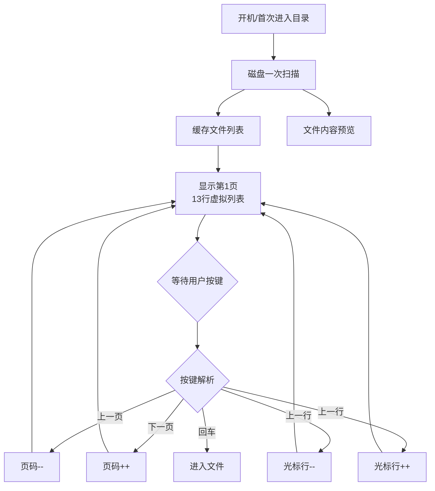

## 优化本地目录界面切换时的延迟问题

### 20250812

### 客户需求

1）程序目录页面在切换时必须流畅，不得出现明显卡顿。

### 需求实现

#### 1、按键处理

```c
//将全局变量改成结构体防止误用
//CNCviewprg.h文件
//程序本地目录
typedef struct 
{
    int pageStart;//当前页的第一行 
	int pageEnd;//当前页的最后一行 
}OptimizePrgDir;
//CNCviewprg.c文件
OptimizePrgDir OPD;
//prg_prgdir_event.c
extern OptimizePrgDir OPD;

//按键处理上一页
if (OPD.pageStart >= 0)
	{ 
		OPD.pageStart = (OPD.pageStart - 13 > 0) ? OPD.pageStart - 13 : 0;
		ShowCNCPrgList_PrgDirectory(ViewPrg.showType, 1, 0);
        LISTVIEW_DecPage(hListviewBuf[0]);
		LISTVIEW_SetSel(hListviewBuf[0], 0); 
	}
//按键处理下一页
if (OPD.pageEnd < ViewPrg.TotalFileNum[1])
				{ 
					OPD.pageStart += 13; 
					ShowCNCPrgList_PrgDirectory(ViewPrg.showType, 1, 0);
					LISTVIEW_AddPage(hListviewBuf[0]);
					LISTVIEW_SetSel(hListviewBuf[0], 0); 
				}
				if (OPD.pageEnd == ViewPrg.TotalFileNum[1])
				{ 
					LISTVIEW_SetSel(hListviewBuf[0], 13); 
				}
//按键处理上一行
int curSel = LISTVIEW_GetSel(hListviewBuf[0]);//返回当前在指定的 LISTVIEW 中所选的行数。
				int numRows = LISTVIEW_GetNumRows(hListviewBuf[0]); // 获取当前列表视图的行数（最多 13）
				if (curSel > 0)
				{
					LISTVIEW_DecSel(hListviewBuf[0]); 
				}
				else if (OPD.pageStart > 0) 
				{ 
					OPD.pageStart -= 1;
					ShowCNCPrgList_PrgDirectory(ViewPrg.showType, 1, 0);
					LISTVIEW_SetSel(hListviewBuf[0], 0); 
				}
//按键处理下一行
 int curSel = LISTVIEW_GetSel(hListviewBuf[0]);
				int numRows = LISTVIEW_GetNumRows(hListviewBuf[0]); 
				if (curSel < (numRows - 1))
				{
					LISTVIEW_IncSel(hListviewBuf[0]);
				}
				else if ((OPD.pageStart + numRows) < ViewPrg.TotalFileNum[1]) // 如果在页面底部且有下一页
				{ 
					OPD.pageStart += 1;  // 向下滚动一行的起始位置
					ShowCNCPrgList_PrgDirectory(ViewPrg.showType, 1, 0);
					numRows = LISTVIEW_GetNumRows(hListviewBuf[0]); // 获取新列表的行数
					LISTVIEW_SetSel(hListviewBuf[0], numRows-1); // 设置选择到底部（保持光标在底部位置）
				}
//按键处理进入文件内
WM_HWIN hList = WM_GetDialogItem(hWin, GUI_ID_LISTVIEW0);
                i = LISTVIEW_GetSel(hListviewBuf[0]);
				char itemText[100]; // 临时缓冲区存储文件名
				LISTVIEW_GetItemText(hList, 0, i, itemText, sizeof(itemText));//获取第0列文件名
				strcpy(ViewPrg.PrgFiles[1][i].name,itemText);   
                strcpy(FileStr, ViewPrg.PrgFiles[1][i].name);   

```


#### 2）分页加载

```c
// 计算当前页的结束索引
int GetPageEndIndex(int pageStart, int totalCount, int pageSize) 
{
    return (pageStart + pageSize > totalCount) ? totalCount : pageStart + pageSize;
}
    //加到列表框
    LISTVIEW_DeleteAllRows(ViewPrg.pMainListCtrl->CtrlID);
	OPD.pageEnd = GetPageEndIndex(OPD.pageStart, ViewPrg.TotalFileNum[1], 13);
 	   for (j = OPD.pageStart; j < OPD.pageEnd; j++)
		{
	   	int listViewRow = j - OPD.pageStart; //文件在当前页面的行数
        LISTVIEW_AddRow(ViewPrg.pMainListCtrl->CtrlID, pp);
        LISTVIEW_SetItemText(ViewPrg.pMainListCtrl->CtrlID, 0, listViewRow, ViewPrg.PrgFiles[1][j].name);//名称
		if(ViewPrg.PrgFiles[1][j].fattrib & AM_RDO)//只读
		{
			LISTVIEW_SetItemText(ViewPrg.pMainListCtrl->CtrlID, 1, listViewRow, g_UIShowText[UIShowText_881]);
		}
        {
           LISTVIEW_SetItemText(ViewPrg.pMainListCtrl->CtrlID, 1, listViewRow, ViewPrg.PrgFiles[1][j].note);//从数组中读取
        }
        snprintf(buf,9, "%s", ViewPrg.PrgFiles[1][j].strTime);
        LISTVIEW_SetItemText(ViewPrg.pMainListCtrl->CtrlID, 3, listViewRow, buf);
		SwitchFileSize(ViewPrg.PrgFiles[1][j].size, buf);
        LISTVIEW_SetItemText(ViewPrg.pMainListCtrl->CtrlID, 2, listViewRow, buf);
		if(ViewPrg.PrgFiles[1][j].fattrib & AM_RDO)//只读
		{
			LISTVIEW_SetItemBitmap(ViewPrg.pMainListCtrl->CtrlID,4, listViewRow,&bmLockOff);
			LISTVIEW_SetItemTextColor(ViewPrg.pMainListCtrl->CtrlID,0,listViewRow,0,GUI_RED);
			LISTVIEW_SetItemTextColor(ViewPrg.pMainListCtrl->CtrlID,1,listViewRow,0,GUI_RED);
			LISTVIEW_SetItemTextColor(ViewPrg.pMainListCtrl->CtrlID,2,listViewRow,0,GUI_RED);
			LISTVIEW_SetItemTextColor(ViewPrg.pMainListCtrl->CtrlID,3,listViewRow,0,GUI_RED);
			LISTVIEW_SetItemTextColor(ViewPrg.pMainListCtrl->CtrlID,4,listViewRow,0,GUI_RED);
		}
		else
		{
			LISTVIEW_SetItemBitmap(ViewPrg.pMainListCtrl->CtrlID,4, listViewRow,NULL);
			LISTVIEW_SetItemTextColor(ViewPrg.pMainListCtrl->CtrlID,0,listViewRow,0,GUI_BLACK);
			LISTVIEW_SetItemTextColor(ViewPrg.pMainListCtrl->CtrlID,1,listViewRow,0,GUI_BLACK);
			LISTVIEW_SetItemTextColor(ViewPrg.pMainListCtrl->CtrlID,2,listViewRow,0,GUI_BLACK);
			LISTVIEW_SetItemTextColor(ViewPrg.pMainListCtrl->CtrlID,3,listViewRow,0,GUI_BLACK);
			LISTVIEW_SetItemTextColor(ViewPrg.pMainListCtrl->CtrlID,4,listViewRow,0,GUI_BLACK);
		}
		//停留在当前文件行//删除操作后不需要
        if(memcmp(ViewPrg.PrgFiles[1][j].name,CurSegMode.ProgramName,PrgFileNameLen) == 0)
        {
            ViewPrg.LocalCurSel =listViewRow ;
            ViewPrg.pMainListCtrl->CurrentSel = listViewRow;
        }
        if(CurrentViewFlag == UIPAGE_prog_UDirect) // 文件目录界面不需要停在当前文件行
        {
            ViewPrg.LocalCurSel = 0;
            ViewPrg.pMainListCtrl->CurrentSel = 0;
        }
    }
```


#### 3）预览显示

```markdown
graph TD
    A[开机/首次进入目录] --> B[磁盘一次扫描]
    B --> C[缓存文件列表<br>g_FileNames]
    C --> D[显示第1页<br>13行虚拟列表]
    D --> E{等待用户按键}
    E --> F{按键解析}
    
    F -- 上一页 --> G[页码--]
    F -- 下一页 --> H[页码++]
    F -- ↑ --> I[光标行--]
    F -- ↓ --> J[光标行++]
    F -- 回车 --> K[进入文件]
    
    G --> D
    H --> D
    I --> D
    J --> D
    
    K --> L[文件内容预览]

    subgraph 状态变量
        direction LR
        g_CurPage([页码 g_CurPage])
        g_Cursor([光标行 g_Cursor])
    end
```


#####   设计思路




